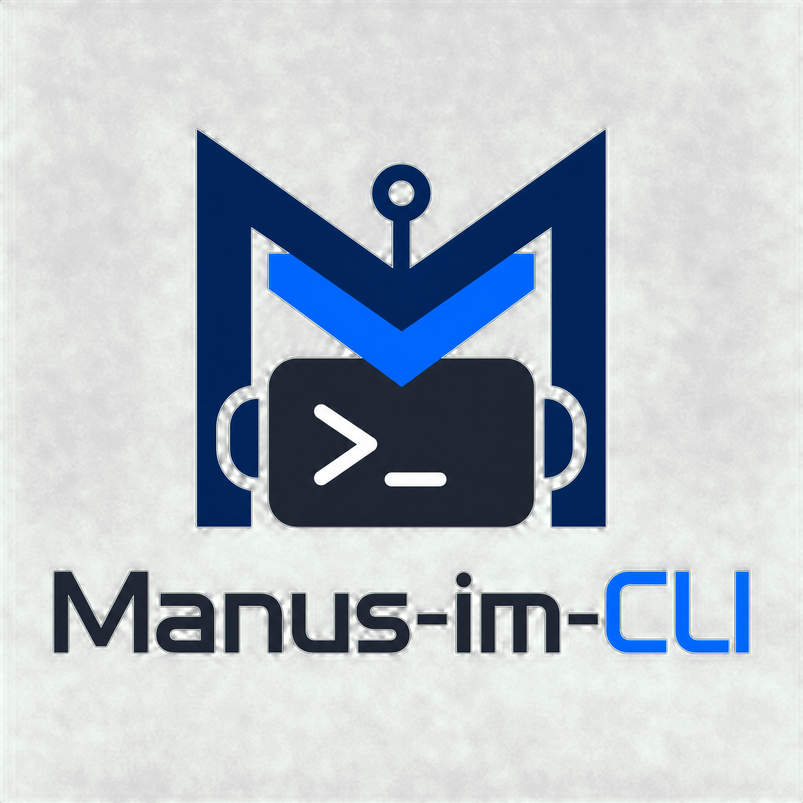
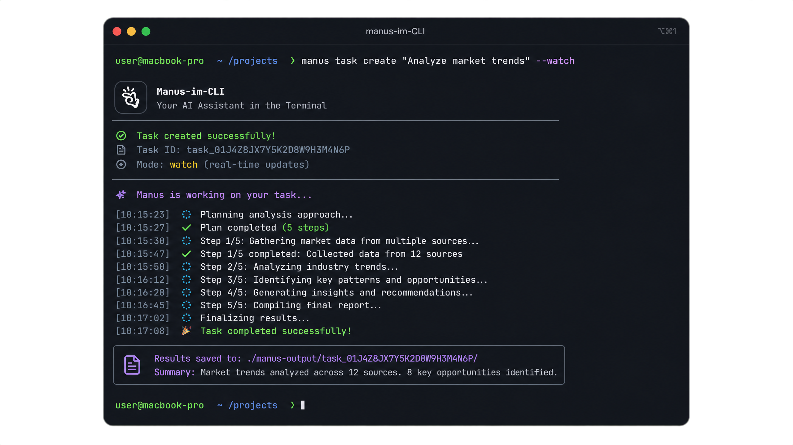

<div align="center">
  
  <h1>Manus-im-CLI</h1>
  <p><b>ターミナルで動く自律型 AI エージェントプラットフォーム</b></p>
  
  <p>
    <a href="../README.md">English</a> |
    <a href="README.zh.md">中文</a> |
    <a href="README.es.md">Español</a> |
    <a href="README.fr.md">Français</a> |
    <a href="README.ja.md">日本語</a>
  </p>

  <p>
    
    
    
    
  </p>
</div>

---

## 🌟 概要

`Manus-im-CLI` は、**Manus AI エージェントプラットフォーム** (`https://manus.im`) のためのフル機能かつプロダクションレディなコマンドラインインターフェースクライアントであり、公式の Manus REST API v2 をラップしています [1]。開発者、エンジニア、パワーユーザーは、Linux ターミナルから直接、自律型 AI エージェントのタスクを作成、監視、対話、管理することができます。

<div align="center">
  
  <p><em>Manus-im-CLI によるインタラクティブなタスク作成とリアルタイムイベントストリーミング</em></p>
</div>

---

## 🔑 API キーの取得

API 呼び出しや認証を行う前に、アカウントから API キーを作成する必要があります：
1. Manus ウェブアプリの [Manus API 統合設定](https://manus.im/app?show_settings=integrations&app_name=api) に移動します [2]。
2. **Create API Key** をクリックし、分かりやすい名前（例：`cli-production`）を入力します [2]。
3. キーを即座にコピーし、安全に保管してください [2]。

---

## 📦 インストール

Linux Ubuntu (20.04 / 22.04 / 24.04) 環境で、Python 3.10+ と `pip` がインストールされていることを確認します：

```bash
sudo apt update && sudo apt install -y python3 python3-pip python3-venv
```

### オプション A：`pipx` によるインストール（推奨）
```bash
pipx install .
```

### オプション B：`pip` による開発モードでのインストール
```bash
pip install -e .
```

---

## 🚀 クイックスタート

1. **安全な認証の設定**：
   ```bash
   manus auth login
   ```
   *（または環境変数 `MANUS_API_KEY` を設定してください）。*

2. **認証状態の確認**：
   ```bash
   manus auth whoami
   ```

3. **自律型タスクの作成と監視**：
   ```bash
   manus task create "Q2のテクノロジー市場トレンドを分析し、主要なインサイトをまとめる" --watch
   ```

---

## 📋 コマンドリファレンス

### 認証 (`manus auth`)
| コマンド | 説明 |
| :--- | :--- |
| `manus auth login [--api-key KEY]` | 対話形式またはフラグを使用して、Manus API キーを `~/.config/manus/config.toml` に安全に保存します（パーミッション `0600`）[3]。 |
| `manus auth whoami` | 現在の認証状態を確認し、利用可能なプラットフォームクレジットを取得します [3]。 |

### タスク (`manus task`)
| コマンド | 説明 |
| :--- | :--- |
| `manus task create "<prompt>" [options]` | 新しいタスクを作成します。`--file`、`--project`、`--connector`、`--skill`、`--json`、`--watch` フラグをサポートします。プロンプトが `-` または省略された場合は標準入力を受け付けます [3]。 |
| `manus task list [options]` | `--status`（`running`、`stopped`、`waiting`、`error`）、`--project`、`--limit` でフィルタリングしてタスクの一覧を表示します [3]。 |
| `manus task get <task_id>` | 特定のタスクの詳細なメタデータとステータスを取得します [3]。 |
| `manus task watch <task_id>` | イベントをリアルタイムでストリーミングし、スピナーを表示し、インタラクティブな確認プロンプト（`waiting`）を処理します [3]。 |
| `manus task send <task_id> "<message>"` | アクティブまたは待機中のタスクとのマルチターン会話を継続します [3]。 |
| `manus task confirm <task_id> <event_id> [options]` | 保留中のアクションを手動で承認または拒否します（`--accept`、`--reject`、`--input '<json>'`）[3]。 |

### プロジェクト (`manus project`)
| コマンド | 説明 |
| :--- | :--- |
| `manus project create <name> [--instruction TEXT]` | タスクに自動的に適用される共有インストラクションを含む新しいプロジェクトを作成します [4]。 |
| `manus project list` | アカウント内の利用可能なすべてのプロジェクトの一覧を表示します [4]。 |

### ファイル (`manus file`)
| コマンド | 説明 |
| :--- | :--- |
| `manus file upload <path>` | タスクの添付ファイル用に、署名付き URL を介してローカルファイル（PDF、画像、CSV 等）をアップロードします [5]。 |

### ブラウザと設定 (`manus browser` / `manus config`)
| コマンド | 説明 |
| :--- | :--- |
| `manus browser list` | `needConnectMyBrowser` 待ちイベント用のオンライン接続済みブラウザクライアントの一覧を表示します [6]。 |
| `manus config set <key> <value>` | 永続的な設定値を設定します（例：ベース URL の上書き）[7]。 |
| `manus config list` | API キーを自動的にマスクして現在の設定を表示します [7]。 |

---

## 🌐 グローバルオプション

すべてのコマンドは以下のグローバルオプションをサポートしています：
- `--json`: スクリプトや自動化パイプライン用に、構造化された機械可読 JSON を出力します。
- `--verbose` / `--debug`: トラブルシューティング用に、マスク処理された生の HTTP リクエストおよびレスポンスログを出力します。
- `--base-url <url>`: デフォルトの API ベース URL (`https://api.manus.ai`) を上書きします。
- `--no-color`: カラー化された Rich ターミナル出力を無効にします。

---

## 🛠️ テストと開発

HTTP モック用の `pytest` と `respx` を使用してテストスイートを実行します：
```bash
pytest
```

リンターとフォーマットのチェックを実行します：
```bash
ruff check src tests
black --check src tests
```

---

## 📄 ライセンス

**MIT ライセンス** の下で配布されています。詳細については `LICENSE` をご覧ください。

---

## 📚 参考文献

- [1] Manus API v2 Introduction: `https://open.manus.ai/docs/v2/introduction`
- [2] Manus Authentication Guide: `https://open.manus.ai/docs/v2/authentication.md`
- [3] Manus Task Lifecycle Guide: `https://open.manus.ai/docs/v2/task-lifecycle.md`
- [4] Manus Projects Documentation: `https://open.manus.ai/docs/v2/project.create.md`
- [5] Manus Files Documentation: `https://open.manus.ai/docs/v2/file.upload.md`
- [6] Manus Browser Integration: `https://open.manus.ai/docs/v2/browser.onlineList.md`
- [7] Manus CLI Configuration: `https://open.manus.ai/docs/v2/introduction`
